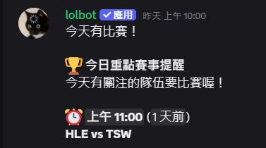
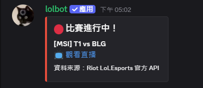
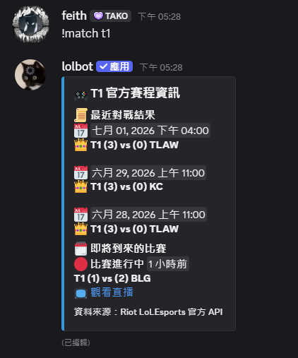
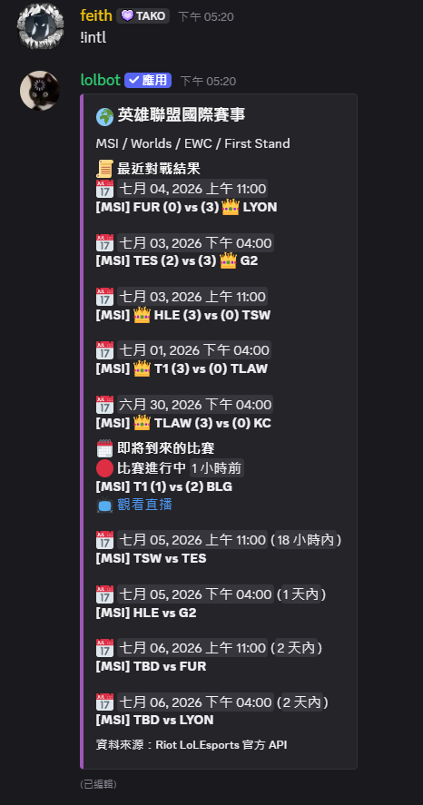
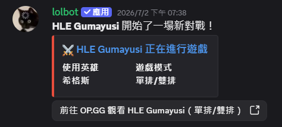
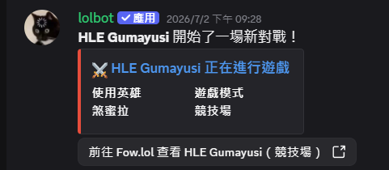
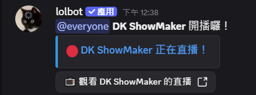
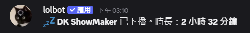

# LoL Esports, Pro Player Rank, & Live Stream Tracker

A Discord Bot Built for the **Chinese-Speaking** League of Legends Esports Community.

**[Official Documentation](https://garnet-scallop-878.notion.site/lolbot-LOL-Tracker-38e0c618a4b3800aa221db879c08d837)**

**[Join our Support Discord](https://discord.com/invite/UrKYbDysp3)**

**[Invite the Bot](https://discord.com/oauth2/authorize?client_id=1518046685584953364)**

### About the Project

A Discord bot designed specifically for the League of Legends esports community, helping fans closely follow their favorite professional players and teams.
Key Features

🎮 Pro Player In-Game & Rank Tracking: Powered by the Riot API, the bot continuously monitors pro players' accounts. It sends real-time notifications to Discord servers when a player starts a game, including details like the picked champion and game mode.

📺 Live Stream Notifications: Integrates with platforms like SOOP and CHZZK to instantly notify the community the moment a pro player goes live.

🏆 Global Esports Match Schedules: Provides daily automated reminders and results for LCK and international tournaments (such as MSI and Worlds).

## Screenshots in Action
### 📅 Daily Match Reminders for Tracked Teams

### 🏆 Esports Match Start Alerts

### 🏆 Team Schedule Inquiry

### 🌍 International Tournament Tracker

### 🎮 Pro Player In-Game Alerts (Ranked & Other Modes)

### 📺 Pro Player Live Stream Notifications (Online / Offline)

## [📜 Read our Privacy Policy & Terms of Service](privacy-and-terms.md)

## Legal Disclaimer
[lolbot] isn't endorsed by Riot Games and doesn't reflect the views or opinions of Riot Games or anyone officially involved in producing or managing Riot Games properties. Riot Games, and all associated properties are trademarks or registered trademarks of Riot Games, Inc.
